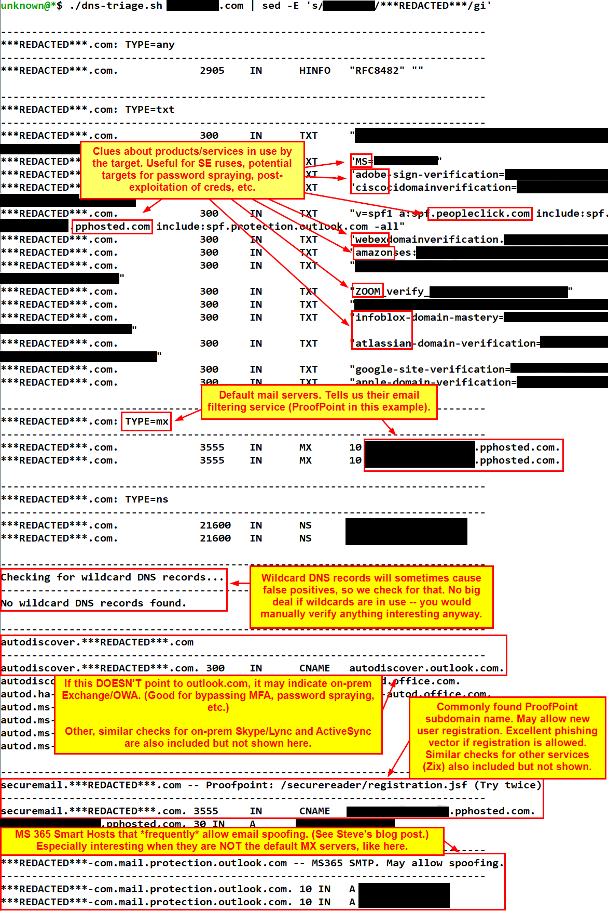

dns-triage
==========

A simple bash script to check default and *really* common DNS records to quickly identify external services and other interesting things about your target.

Usage
-----

```bash
bash dns-triage.sh <Second-Level Domain> [Optional DNS Server]
```

Example: 

```
bash dns-triage.sh example.com
```

Sample output:




See also
--------

- NetSPI script for automated analysis of TXT records
    - https://raw.githubusercontent.com/NetSPI/PowerShell/master/Resolve-DnsDomainValidationToken.ps1


Changelog
---------

- **2023-11-01**
    - Corrected the ProofPoint securemail registration URL.

- **2023-10-31: Happy Halloween! 🎃**
	- Public release on GitHub.
	- Added check for ADP payroll URL. 

- **2023-09-20**
    - Added check for Box.com - learned from Beau's "Breaching the Cloud" class. 🙂

- **2023-08-14**
    - Added check for MFA subdomain, additional Zoom vanity URL format.

- **2023-06-20**
    - Added check for Webex third-party service subdomain.

- **2023-03-28:**
    - Added ability to optionally specify a target DNS server.
    - Fixed a typo that was breaking "fs" subdomain detection.
    - Updated Slack detection to be via web instead of DNS.
    - Updated third party DNS check to better account for multiple IP addresses returned for a subdomain.
    - Added web-based detection of Atlassian (Jira/Confluence/Trello).

- **2023-01-17:** Added new user registration URL for Zix Secure Message Center.

- **2023-01-10:** Added additional URLs and guidance for on-prem Microsoft services.

- **2022-12-05:** Added checks for third-party services:
    - Okta
    - ServiceNow
    - Salesforce
    - Slack
    - Zoom (vanity URL)
    - Ivanti

- **2022-11-04:** Initial internal (BHIS) release.
