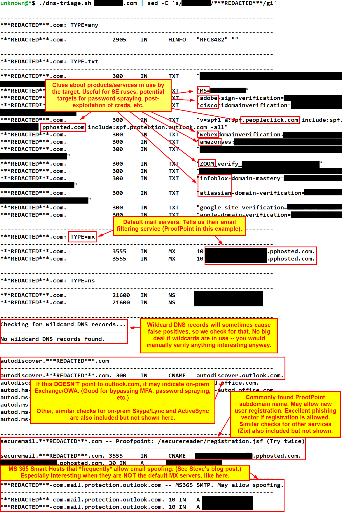

dns-triage (Deprecated as of 2024-02-23)
----------

This is the old version of `dns-triage`, originally written as a Bash script.

Setup
-----

Install the needed Python modules before running the script.

```bash
python3 -m pip install -r requirements.txt
```


Usage
-----

```bash
bash dns-triage.sh <Second-Level Domain> [Optional DNS Server]
```

Example: 

```
bash dns-triage.sh example.com
```

Sample output:

